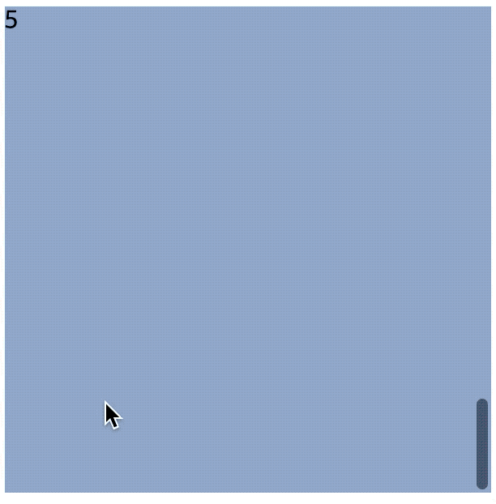

# 대강 스크롤 슬라이더

> 이렇게 쉽다고?

CSS의 `scroll-snap`을 이용한 대강 슬라이더를 만드는 방법.

# # scroll-snap

`CSS`의 속성 중 `scroll-snap`이 있는데 이 기능은 아주 신박하다. 알아두면 언제나 어디서나 쉽고 간편하게 슬라이더 효과를 줄 수 있다.

정말 간단하니 사용에 대해서 빠르게 이야기를 해보자.

## 1.

먼저 스크롤 슬라이드 효과를 주고 싶은 영역에 크기 및 scroll container로 지정한다.

```html
<style>
  .carousel-wrapper {
    overflow-y: scroll;
    width: 300px;
    height: 300px;
  }
</style>

<div class="carousel-wrapper"></div>
```

## 2.

그 다음 슬라이드를 할 자식들을 만든다.

```html
<style>
  .carousel-wrapper {
    overflow-y: scroll;
    width: 300px;
    height: 300px;
  }
  .carousel-wrapper article {
    width: 100%;
    height: 100%;
  }
  .carousel-wrapper article:nth-child(1) {
    background-color: #0f4c81;
  }
  .carousel-wrapper article:nth-child(2) {
    background-color: #ff6f61;
  }
  .carousel-wrapper article:nth-child(3) {
    background-color: #5f488b;
  }
  .carousel-wrapper article:nth-child(4) {
    background-color: #88b048;
  }
  .carousel-wrapper article:nth-child(5) {
    background-color: #92abd1;
  }
</style>

<div class="carousel-wrapper">
  <article>1</article>
  <article>2</article>
  <article>3</article>
  <article>4</article>
  <article>5</article>
</div>
```

여기까지 만든 후 확인 해보면 이런 페이지가 될 것이다.



## 3.

이제 `scroll-snap`을 사용하자. 현재 `scroll-snap` 으로 관련된 다섯 속성이 있다.

(각 각속성들을 알고 있으면 쏠쏠히 사용할 기회가 많으니 따로 알아두길 추천한다. 현재의 글에서는 `scroll-snap-type` 와 `scroll-snap-align`을 사용할 것이다.)

1. scroll-margin
2. scroll-padding
3. scroll-snap-type
4. scroll-snap-align
5. scroll-snap-stop

`scroll-snap-type`에는 axis와 strictness를 지정 할 수 있으며, `scroll-snap-align`의 경우 snap의 정렬 방식을 지정한다.

```css
    scroll-snap-type: none | [ x | y | block | inline | both ] [ mandatory | proximity ]
    scroll-snap-align: none | start | end | center
```

`scroll-snap-type`의 경우 scroll container에 지정해주고, `scroll-snap-align`의 경우 자식에게 걸여주면 끝!

```html
<style>
  .carousel-wrapper {
    overflow-y: scroll;
    scroll-snap-type: y mandatory;
    width: 300px;
    height: 300px;
  }
  .carousel-wrapper article {
    scroll-snap-align: center;
    width: 100%;
    height: 100%;
  }
  .carousel-wrapper article:nth-child(1) {
    background-color: #0f4c81;
  }
  .carousel-wrapper article:nth-child(2) {
    background-color: #ff6f61;
  }
  .carousel-wrapper article:nth-child(3) {
    background-color: #5f488b;
  }
  .carousel-wrapper article:nth-child(4) {
    background-color: #88b048;
  }
  .carousel-wrapper article:nth-child(5) {
    background-color: #92abd1;
  }
</style>

<div class="carousel-wrapper">
  <article>1</article>
  <article>2</article>
  <article>3</article>
  <article>4</article>
  <article>5</article>
</div>
```


# # 추가

`y`축 뿐 아니라 `x`축으로도 가능하며 `navigation`도 쉽게 만들어 줄 수 있다. `scroll-behavior`를 이용해 부~드럽게 만들어주자.

```html
<!DOCTYPE html>
<html lang="en">
  <head>
    <meta charset="UTF-8" />
    <meta name="viewport" content="width=device-width, initial-scale=1.0" />
    <title>Scroll Snap</title>
    <style>
      .carousel-wrapper {
        margin-top: 30px;
        scroll-behavior: smooth;
        -webkit-overflow-scrolling: touch;
      }
      .carousel-wrapper.y {
        overflow-y: scroll;
        scroll-snap-type: y mandatory;
        width: 300px;
        height: 300px;
        color: #fff;
      }
      .carousel-wrapper.x {
        display: flex;
        overflow-x: scroll;
        scroll-snap-type: x proximity;
        width: 300px;
        height: 300px;
        color: #fff;
      }
      .carousel-wrapper.y article {
        width: 100%;
        height: 100%;
        scroll-snap-align: center;
      }
      .carousel-wrapper.x article {
        min-width: 100%;
        height: 100%;
        scroll-snap-align: center;
      }
      .carousel-wrapper article:nth-child(1) {
        background-color: #0f4c81;
      }
      .carousel-wrapper article:nth-child(2) {
        background-color: #ff6f61;
      }
      .carousel-wrapper article:nth-child(3) {
        background-color: #5f488b;
      }
      .carousel-wrapper article:nth-child(4) {
        background-color: #88b048;
      }
      .carousel-wrapper article:nth-child(5) {
        background-color: #92abd1;
      }
    </style>
  </head>
  <body>
    <div class="carousel-wrapper y">
      <article id="y1">1</article>
      <article id="y2">2</article>
      <article id="y3">3</article>
      <article id="y4">4</article>
      <article id="y5">5</article>
    </div>
    <ol>
      <li><a href="#y1">article 1</a></li>
      <li><a href="#y2">article 2</a></li>
      <li><a href="#y3">article 3</a></li>
      <li><a href="#y4">article 4</a></li>
      <li><a href="#y5">article 5</a></li>
    </ol>
    <div class="carousel-wrapper x">
      <article id="x1">1</article>
      <article id="x2">2</article>
      <article id="x3">3</article>
      <article id="x4">4</article>
      <article id="x5">5</article>
    </div>
    <ol>
      <li><a href="#x1">article 1</a></li>
      <li><a href="#x2">article 2</a></li>
      <li><a href="#x3">article 3</a></li>
      <li><a href="#x4">article 4</a></li>
      <li><a href="#x5">article 5</a></li>
    </ol>
  </body>
</html>
```


