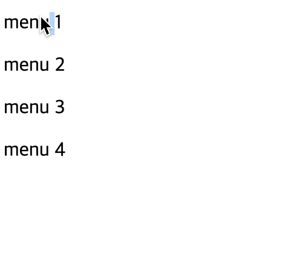
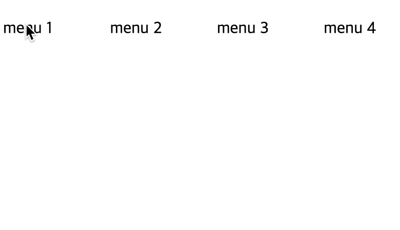
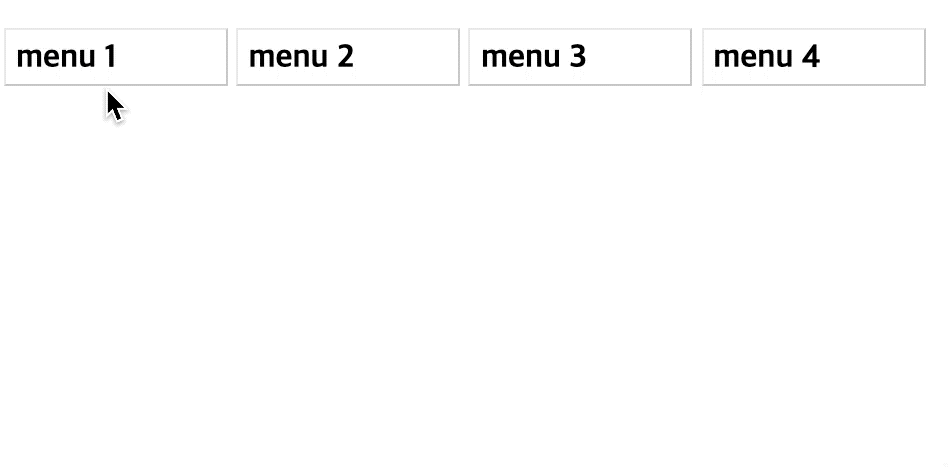

# Drop down menu

> 오뚜기 5분 드롭 다운 메뉴

`Drop down menu` 는 웹을 하다보면 무수히 많은 곳에서 활용 할 수 있다. 하지만, 이것을 만들 때 `javascrtip`의 도움으로 `class`를 변경하는 방식으로 많이 만들고 있지만, 복잡한 기능이 필요한 것이 아니면 어느 정도는 `HTML`, `CSS`만으로 만들 수 있다.

`drop down menu` 를 만들 때 가장 중요한 부분은 **css**의 `셀럭터`의 활용과 html의 `구조`라고 말 할 수 있다.

앞으로 나올 코드들은 이해를 위한 코드로 표준 및 최적화는 생략한다.

## 1. Click

---

메뉴를 클릭 했을 때 나오는 메뉴의 경우 `input:checkbox`와 `label` 그리고 `CSS selector`들을 이용해 만들 수 있다. `Click`으로 열리는 메뉴의 경우 정말 다양한 마크업에도 적용 시킬 수 있어 가장 편한 방법이라 생각한다.

### 1.1 Vertical menu

---

```html
<!DOCTYPE html>
<html lang="en">
  <head>
    <meta charset="UTF-8" />
    <meta name="viewport" content="width=device-width, initial-scale=1.0" />
    <title>drop-down-menu</title>
    <style>
      dl dd {
        display: none;
      }
      input[name="menu-trigger"] {
        display: none;
      }
      input[name="menu-trigger"]:checked + dl dd {
        display: block;
      }
    </style>
  </head>
  <body>
    <input type="checkbox" name="menu-trigger" id="menu1" />
    <dl>
      <dt><label for="menu1">menu 1</label></dt>
      <dd>sub menu 1</dd>
      <dd>sub menu 2</dd>
      <dd>sub menu 3</dd>
      <dd>sub menu 4</dd>
    </dl>
    <input type="checkbox" name="menu-trigger" id="menu2" />
    <dl>
      <dt><label for="menu2">menu 2</label></dt>
      <dd>sub menu 1</dd>
      <dd>sub menu 2</dd>
      <dd>sub menu 3</dd>
      <dd>sub menu 4</dd>
    </dl>
    <input type="checkbox" name="menu-trigger" id="menu3" />
    <dl>
      <dt><label for="menu3">menu 3</label></dt>
      <dd>sub menu 1</dd>
      <dd>sub menu 2</dd>
      <dd>sub menu 3</dd>
      <dd>sub menu 4</dd>
    </dl>
    <input type="checkbox" name="menu-trigger" id="menu4" />
    <dl>
      <dt><label for="menu4">menu 4</label></dt>
      <dd>sub menu 1</dd>
      <dd>sub menu 2</dd>
      <dd>sub menu 3</dd>
      <dd>sub menu 4</dd>
    </dl>
  </body>
</html>
```



### 1.2 Horizontal menu

---

```html
<!DOCTYPE html>
<html lang="en">
  <head>
    <meta charset="UTF-8" />
    <meta name="viewport" content="width=device-width, initial-scale=1.0" />
    <title>drop-down-menu</title>
    <style>
      dl {
        display: inline-block;
        vertical-align: top;
        width: 100px;
      }
      dl dd {
        display: none;
        margin: 0;
      }
      input[name="menu-trigger"] {
        display: none;
      }
      input[name="menu-trigger"]:checked + dl dd {
        display: block;
      }
    </style>
  </head>
  <body>
    <input type="checkbox" name="menu-trigger" id="menu1" />
    <dl>
      <dt><label for="menu1">menu 1</label></dt>
      <dd>sub menu 1</dd>
      <dd>sub menu 2</dd>
      <dd>sub menu 3</dd>
      <dd>sub menu 4</dd>
    </dl>
    <input type="checkbox" name="menu-trigger" id="menu2" />
    <dl>
      <dt><label for="menu2">menu 2</label></dt>
      <dd>sub menu 1</dd>
      <dd>sub menu 2</dd>
      <dd>sub menu 3</dd>
      <dd>sub menu 4</dd>
    </dl>
    <input type="checkbox" name="menu-trigger" id="menu3" />
    <dl>
      <dt><label for="menu3">menu 3</label></dt>
      <dd>sub menu 1</dd>
      <dd>sub menu 2</dd>
      <dd>sub menu 3</dd>
      <dd>sub menu 4</dd>
    </dl>
    <input type="checkbox" name="menu-trigger" id="menu4" />
    <dl>
      <dt><label for="menu4">menu 4</label></dt>
      <dd>sub menu 1</dd>
      <dd>sub menu 2</dd>
      <dd>sub menu 3</dd>
      <dd>sub menu 4</dd>
    </dl>
  </body>
</html>
```



### 1.3 한 마디

---

기본적으로 `a + b` **selector**를 이용 할 수 있는 환경은 추후 유지 보수가 어렵지 않지만, 그렇지 않을 경우 대체적으로 유지 보수가 귀찮아 질 수 있다.

## 2. Mouse Over

---

마우스를 올렸을 때 메뉴가 나오는 경우는 `hover`를 이용해서 간단하게 만들 수 있다. 여기서 간단하게 지켜줘야 하는 것은 `menu` 와 `sub menu`를 포함하고 있는 부모에게 `:hover`를 거는 것이다. 그렇지 않으면 원하지 않는 작동이 될 수 있다.

### 2.1 Vertical menu

---

```html
<!DOCTYPE html>
<html lang="en">
  <head>
    <meta charset="UTF-8" />
    <meta name="viewport" content="width=device-width, initial-scale=1.0" />
    <title>drop-down-menu</title>
    <style>
      dl dd {
        display: none;
      }
      dl:hover > dd {
        display: block;
      }
    </style>
  </head>
  <body>
    <dl>
      <dt><label for="menu1">menu 1</label></dt>
      <dd>sub menu 1</dd>
      <dd>sub menu 2</dd>
      <dd>sub menu 3</dd>
      <dd>sub menu 4</dd>
    </dl>
    <dl>
      <dt><label for="menu2">menu 2</label></dt>
      <dd>sub menu 1</dd>
      <dd>sub menu 2</dd>
      <dd>sub menu 3</dd>
      <dd>sub menu 4</dd>
    </dl>
    <dl>
      <dt><label for="menu3">menu 3</label></dt>
      <dd>sub menu 1</dd>
      <dd>sub menu 2</dd>
      <dd>sub menu 3</dd>
      <dd>sub menu 4</dd>
    </dl>
    <dl>
      <dt><label for="menu4">menu 4</label></dt>
      <dd>sub menu 1</dd>
      <dd>sub menu 2</dd>
      <dd>sub menu 3</dd>
      <dd>sub menu 4</dd>
    </dl>
  </body>
</html>
```


### 2.2 Horizontal menu

---

```html
<!DOCTYPE html>
<html lang="en">
  <head>
    <meta charset="UTF-8" />
    <meta name="viewport" content="width=device-width, initial-scale=1.0" />
    <title>drop-down-menu</title>
    <style>
      dl {
        display: inline-block;
        width: 100px;
        vertical-align: top;
      }
      dl dd {
        display: none;
        margin: 0;
      }
      dl:hover > dd {
        display: block;
      }
    </style>
  </head>
  <body>
    <dl>
      <dt><label for="menu1">menu 1</label></dt>
      <dd>sub menu 1</dd>
      <dd>sub menu 2</dd>
      <dd>sub menu 3</dd>
      <dd>sub menu 4</dd>
    </dl>
    <dl>
      <dt><label for="menu2">menu 2</label></dt>
      <dd>sub menu 1</dd>
      <dd>sub menu 2</dd>
      <dd>sub menu 3</dd>
      <dd>sub menu 4</dd>
    </dl>
    <dl>
      <dt><label for="menu3">menu 3</label></dt>
      <dd>sub menu 1</dd>
      <dd>sub menu 2</dd>
      <dd>sub menu 3</dd>
      <dd>sub menu 4</dd>
    </dl>
    <dl>
      <dt><label for="menu4">menu 4</label></dt>
      <dd>sub menu 1</dd>
      <dd>sub menu 2</dd>
      <dd>sub menu 3</dd>
      <dd>sub menu 4</dd>
    </dl>
  </body>
</html>
```


### 2.3 한 마디

---

`:hover`로 처리 할 경우 정말 간단하다.

## 3. Style

---

```html
<!DOCTYPE html>
<html lang="en">
  <head>
    <meta charset="UTF-8" />
    <meta name="viewport" content="width=device-width, initial-scale=1.0" />
    <title>drop-down-menu</title>
    <style>
      dl {
        display: inline-block;
        width: 100px;
        height: 17px;
        padding: 5px;
        overflow-y: hidden;
        border-top: solid 1px #efefef;
        border-right: solid 1px #cdcdcd;
        border-bottom: solid 1px #cdcdcd;
        border-left: solid 1px #efefef;
        border-radius: 2px;
        vertical-align: top;
      }
      dl dt {
        margin-bottom: 5px;
        font-weight: bold;
      }
      dl dd {
        margin: 0;
        line-height: 1.5em;
        color: #333;
      }
      dl:hover {
        height: 120px;
        transition: ease-in 0.3s;
      }
      dl:hover dd:hover {
        color: #ff0;
        background-color: #333;
        padding-left: 10px;
      }
    </style>
  </head>
  <body>
    <dl>
      <dt><label for="menu1">menu 1</label></dt>
      <dd>sub menu 1</dd>
      <dd>sub menu 2</dd>
      <dd>sub menu 3</dd>
      <dd>sub menu 4</dd>
    </dl>
    <dl>
      <dt><label for="menu2">menu 2</label></dt>
      <dd>sub menu 1</dd>
      <dd>sub menu 2</dd>
      <dd>sub menu 3</dd>
      <dd>sub menu 4</dd>
    </dl>
    <dl>
      <dt><label for="menu3">menu 3</label></dt>
      <dd>sub menu 1</dd>
      <dd>sub menu 2</dd>
      <dd>sub menu 3</dd>
      <dd>sub menu 4</dd>
    </dl>
    <dl>
      <dt><label for="menu4">menu 4</label></dt>
      <dd>sub menu 1</dd>
      <dd>sub menu 2</dd>
      <dd>sub menu 3</dd>
      <dd>sub menu 4</dd>
    </dl>
  </body>
</html>
```



아무런 레퍼런스 없이 디자인을 입히고 난 뒤 느꼈다. 나는 디자인에 재능 없다. 튼, `css animation`과 적절한 디자인을 이용하면 기존 `menu`의 모습을 만들 수 있다.

끝-
