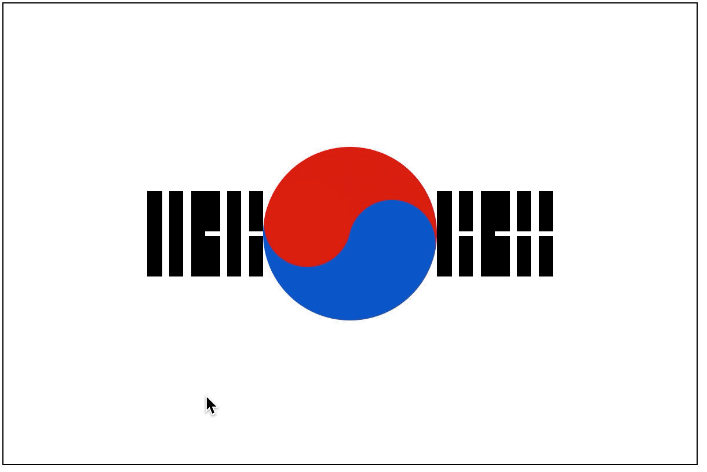

# 대강 태극기

> 펄럭-

HTML과 CSS로 태극기를 만들어 보자.

## 1. 시작

일단 HTML 폼을 적어 준다.

```html
<!DOCTYPE html>
<html lang="ko">
  <head>
    <meta charset="UTF-8" />
    <meta name="viewport" content="width=device-width, initial-scale=1.0" />
    <meta http-equiv="X-UA-Compatible" content="ie=edge" />
    <title>태극기</title>
  </head>
  <body></body>
</html>
```

여기서 주의 할 것은 `태극기`를 만들어 줄 것이기 때문에 `html`의 `lang`은 `ko`로 지정해야 한다. 그 다음에 해야할 것은 [여기](http://www.newsworks.co.kr/news/articleView.html?idxno=2846)를 통해서 `태극기`는 어떻게 만들어야 하는지 천천히 읽어 준다. ~~(하지만, 대강 만들기 위해 나는 대강 읽었다.)~~

## 2. 태극기

태극기의 크기는 3:2 비율이라고 한다. 클래스 명은 태극기를 만드는 작업이니 만큼 한글로 하겠다. 또한 중앙 정렬을 기본으로 잡아놨다.

```html
<div class="태극기"></div>
```

```css
.태극기 {
  position: relative;
  box-sizing: border-box;
  display: flex;
  justify-content: center;
  align-items: center;
  width: 600px;
  height: 400px;
  border: solid 1px #000;
}
```

## 3. 태극 무늬

나의 경우 태극기를 볼 때 가장 눈에 먼저 들어오는 것은 태극 무늬라서 태극 무늬 먼저 만들어 볼 것이다. 태극 무늬를 만들 때는 먼저 동그라미가 필요한데 동그라미 만드는 건 간단하다.

```html
<div class="태극기">
  <div class="태극무늬"></div>
</div>
```

```css
.태극무늬 {
  width: 150px;
  height: 150px;
  border-radius: 50%;
}
```

그 후 태극기는 중심을 기점으로 빨간색과 파란색으로 나뉘어져 있다. 여기서 태극 무늬는 음과 양으로 나뉘어져 있어 마크업을 해보면

```html
<div class="태극기">
  <div class="태극무늬">
    <div class="음"></div>
    <div class="양"></div>
  </div>
</div>
```

이런식으로 되는데 그렇게 되면 음과 양을 따로 따로 곡선을 만들어 줘야 하는데 어차피 대강 만드는 것이니 다른 방식으로 접근했다.

```html
<div class="태극기">
  <div class="태극무늬"></div>
</div>
```

```css
.태극무늬 {
  position: relative;
  width: 150px;
  height: 150px;
  border-radius: 50%;
  background: rgb(221, 17, 17);
  background: linear-gradient(
    195deg,
    rgba(221, 17, 17, 1) 0%,
    rgba(221, 17, 17, 1) 50%,
    rgba(13, 86, 200, 1) 50%,
    rgba(13, 86, 200, 1) 100%
  );
}
```

중심을 기점으로 빨간색과 파란색을 `gradient`으로 채운다. (`gradient` 사용법이 어려운 경우 검색을 통해 generator를 찾을 수 있다.) 그 다음 곡선은 가상 셀렉터 `before`, `after`를 이용하여 표현해준다.

```css
.태극무늬::before {
  position: absolute;
  content: "";
  top: 29px;
  left: 1px;
  width: 50%;
  height: 50%;
  background-color: rgb(221, 17, 17);
  border-radius: 50%;
}
.태극무늬::after {
  position: absolute;
  content: "";
  bottom: 29px;
  right: 1px;
  width: 50%;
  height: 50%;
  background-color: rgb(13, 86, 200);
  border-radius: 50%;
}
```

## 4. 괘

태극 무늬를 그렸으면 이제 4괘를 그려야 한다. 4괘의 종류로는 `건`, `곤`, `감`, `리` 가 있으며 이를 마크업 할 경우 다양한 방법들이 있을텐데 간단하게 생각해보면

**_태극기 디자인 대로 하는 경우_**

```html
<div class="태극기">
  <div class="건괘"></div>
  <div class="감괘"></div>
  <div class="태극무늬">
    <div class="이괘"></div>
    <div class="곤괘"></div>
  </div>
</div>
```

**_집합!_**

```html
<div class="태극기">
  <div class="사괘">
    <div class="건"></div>
    <div class="곤"></div>
    <div class="감"></div>
    <div class="리"></div>
  </div>
  <div class="태극무늬"></div>
</div>
```

간단하게 생각했을 때는 두 가지의 방법이 생각난다. 이 중 어떠한 마크업으로 해도 앞으로 디자인 할 방식에 문제가 없기 때문에 취향대로 하자. 어차피 대강 만드는 태극기이니 깊게 생각하지 말자.

괘를 마크업 했으면 이제 괘를 구성하는 검은 선을 그려야 하는데 이것을 `효`라고 칭한다. 이 효를 만드는 방법 또한, 몇가지의 방법이 있을텐데 간단하게 생각해보면

_~~**효는 반효도 있다 아이가!**~~_

```html
<div class="건괘">
  <div class="효"></div>
  <div class="효"></div>
  <div class="효"></div>
</div>
<div class="감괘">
  <div class="반효"></div>
  <div class="효"></div>
  <div class="반효"></div>
</div>
<div class="이괘">
  <div class="효"></div>
  <div class="반효"></div>
  <div class="효"></div>
</div>
<div class="곤괘">
  <div class="반효"></div>
  <div class="반효"></div>
  <div class="반효"></div>
</div>
```

_~~**선이 하나냐 두 개냐 그것이 문제로다**~~_

```html
<div class="건괘">
  <div class="효">
    <div class="선"></div>
  </div>
  <div class="효">
    <div class="선"></div>
  </div>
  <div class="효">
    <div class="선"></div>
  </div>
</div>
<div class="감괘">
  <div class="효">
    <div class="선"></div>
    <div class="선"></div>
  </div>
  <div class="효">
    <div class="선"></div>
  </div>
  <div class="효">
    <div class="선"></div>
    <div class="선"></div>
  </div>
</div>
<div class="이괘">
  <div class="효">
    <div class="선"></div>
  </div>
  <div class="효">
    <div class="선"></div>
    <div class="선"></div>
  </div>
  <div class="효">
    <div class="선"></div>
  </div>
</div>
<div class="곤괘">
  <div class="효">
    <div class="선"></div>
    <div class="선"></div>
  </div>
  <div class="효">
    <div class="선"></div>
    <div class="선"></div>
  </div>
  <div class="효">
    <div class="선"></div>
    <div class="선"></div>
  </div>
</div>
```

역시나 두 가지 방법이 있는데 클래스 명을 두 가지로 할 것인지 아니면 효를 구성하는 자식을 만들 것인지(부모님께 효를..) 잠시 고민을 해봤고 결국 둘 다 만들어 본 결과 관리의 측면에서는 자식으로 구성하는 것이 좋다는 생각으로 그렇게 넘어갔다.

그럼 이제 사괘를 그려 보자. 사괘를 그릴때는 효 안에 선이 한 개 아니면 두 개인지 생각하고 그리면 될 것 같다.

```css
.건괘,
.감괘,
.이괘,
.곤괘 {
  display: flex;
  width: 50px;
  height: 78px;
  justify-content: space-between;
}
.효 {
  display: flex;
  flex-direction: column;
  justify-content: space-between;
  width: 12.5px;
  height: 100%;
}
.효 .선 {
  flex: 1;
  margin: 2px 0;
  background-color: #000;
}
```

효를 구성하는 선이 복수로 있을 경우 유동적으로 자리를 차지 하기 위해 효를 `display: flex` 설정을 해주고 양쪽 정렬을 해준다. 복수의 선은 같은 크기를 가져야 하기 때문에 `flex: 1`의 크기를 준다. 하지만, 문제는 두 선은 약간 떨어져 있어야 하기 때문에 그를 위한 `margin`을 추가하며 그로인해 양쪽에 생기는 margin으로 작아지는 선의 크기를 위하여 각 괘의 크기를 `margin` 만큼 추가해서 영역을 잡았다.

## 5. 마무리

이제 사괘와 태극무늬가 모두 완성이 됐지만 따로 각 요소의 위치를 잡아준 건 없기 때문에 `.태극기`에서 잡아 놓은 중앙 정렬로 모두 보일 것이다. 그렇기 때문에 이제 각 요소들의 중앙 정렬을 해주면 된다.

```css
.건괘 {
  position: absolute;
  top: 15%;
  left: 15%;
  transform: rotate(40deg);
}
.감괘 {
  position: absolute;
  top: 15%;
  right: 15%;
  transform: rotate(-40deg);
}
.이괘 {
  position: absolute;
  bottom: 15%;
  left: 15%;
  transform: rotate(140deg);
}
.곤괘 {
  position: absolute;
  bottom: 15%;
  right: 15%;
  transform: rotate(-140deg);
}
```

태극무늬는 태극기의 정중앙에 있기 때문에 사괘의 위치만 `absolute`를 이용하여 위치를 잡아줬으며, `transform: rotate(number)`를 통하여 사괘의 각도를 수정하여 완성! 하지만, 이 코드에 슬픈점은 `.태극기`가 `flex`로 선언이 되어 있기 때문에 사괘의 위치를 `flex`를 이용하여 잡고 싶었으나, 그렇게 되면 몇가지 제약이 생겨 포기했다.



```html
<!DOCTYPE html>
<html lang="en">
  <head>
    <meta charset="UTF-8" />
    <meta name="viewport" content="width=device-width, initial-scale=1.0" />
    <meta http-equiv="X-UA-Compatible" content="ie=edge" />
    <title>태극기</title>
    <style>
      .태극기 {
        position: relative;
        box-sizing: border-box;
        display: flex;
        justify-content: center;
        align-items: center;
        width: 600px;
        height: 400px;
        border: solid 1px #000;
      }
      .태극무늬 {
        position: relative;
        width: 150px;
        height: 150px;
        border-radius: 50%;
        background: rgb(221, 17, 17);
        background: linear-gradient(
          195deg,
          rgba(221, 17, 17, 1) 0%,
          rgba(221, 17, 17, 1) 50%,
          rgba(13, 86, 200, 1) 50%,
          rgba(13, 86, 200, 1) 100%
        );
      }
      .태극무늬::before {
        position: absolute;
        content: "";
        top: 29px;
        left: 1px;
        width: 50%;
        height: 50%;
        background-color: rgb(221, 17, 17);
        border-radius: 50%;
      }
      .태극무늬::after {
        position: absolute;
        content: "";
        bottom: 29px;
        right: 1px;
        width: 50%;
        height: 50%;
        background-color: rgb(13, 86, 200);
        border-radius: 50%;
      }
      .건괘,
      .감괘,
      .이괘,
      .곤괘 {
        display: flex;
        width: 50px;
        height: 78px;
        justify-content: space-between;
      }
      .건괘 {
        position: absolute;
        top: 15%;
        left: 15%;
        transform: rotate(40deg);
      }
      .감괘 {
        position: absolute;
        top: 15%;
        right: 15%;
        transform: rotate(-40deg);
      }
      .이괘 {
        position: absolute;
        bottom: 15%;
        left: 15%;
        transform: rotate(140deg);
      }
      .곤괘 {
        position: absolute;
        bottom: 15%;
        right: 15%;
        transform: rotate(-140deg);
      }
      .효 {
        display: flex;
        flex-direction: column;
        justify-content: space-between;
        width: 12.5px;
        height: 100%;
      }
      .효 .선 {
        flex: 1;
        margin: 2px 0;
        background-color: #000;
      }
    </style>
  </head>
  <body>
    <div class="태극기">
      <div class="건괘">
        <div class="효">
          <div class="선"></div>
        </div>
        <div class="효">
          <div class="선"></div>
        </div>
        <div class="효">
          <div class="선"></div>
        </div>
      </div>
      <div class="감괘">
        <div class="효">
          <div class="선"></div>
          <div class="선"></div>
        </div>
        <div class="효">
          <div class="선"></div>
        </div>
        <div class="효">
          <div class="선"></div>
          <div class="선"></div>
        </div>
      </div>
      <div class="태극무늬"></div>
      <div class="이괘">
        <div class="효">
          <div class="선"></div>
        </div>
        <div class="효">
          <div class="선"></div>
          <div class="선"></div>
        </div>
        <div class="효">
          <div class="선"></div>
        </div>
      </div>
      <div class="곤괘">
        <div class="효">
          <div class="선"></div>
          <div class="선"></div>
        </div>

        <div class="효">
          <div class="선"></div>
          <div class="선"></div>
        </div>

        <div class="효">
          <div class="선"></div>
          <div class="선"></div>
        </div>
      </div>
    </div>
  </body>
</html>
```
